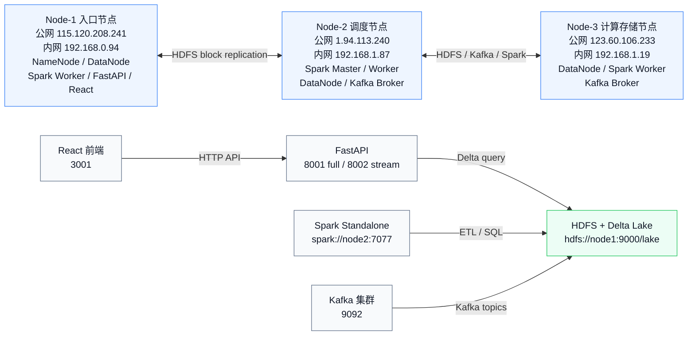
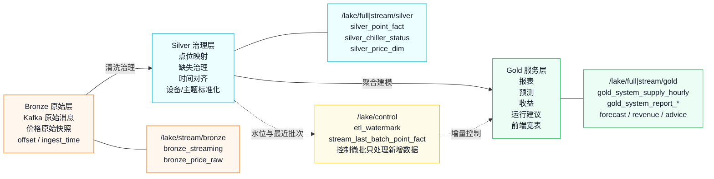
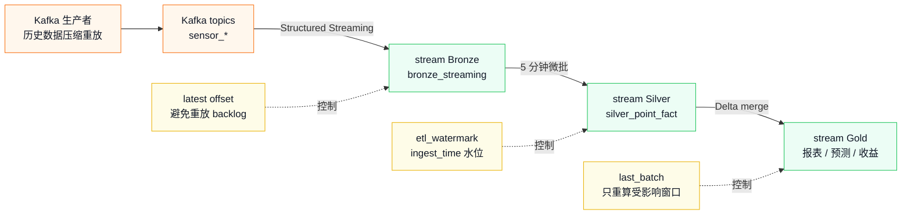
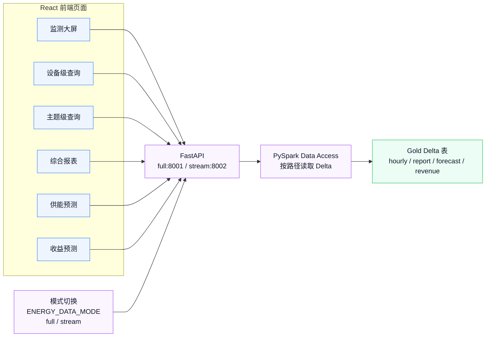

# 系统说明文档 Mermaid 图源

本文档是 `system_report.tex` 中 4 张图的 Mermaid/Markdown 版本。可在 Typora、Obsidian、GitHub、VS Code Mermaid 插件中直接预览，也可以用 `mermaid-cli` 导出为 PDF/SVG/PNG。

## 导出方式

当前机器未安装 `mmdc`。安装后可在项目根目录运行：

```bash
npm install -g @mermaid-js/mermaid-cli

mmdc -i docs/assets/fig_deployment.mmd -o docs/assets/fig_deployment.pdf -b transparent
mmdc -i docs/assets/fig_lake_layers.mmd -o docs/assets/fig_lake_layers.pdf -b transparent
mmdc -i docs/assets/fig_stream_microbatch.mmd -o docs/assets/fig_stream_microbatch.pdf -b transparent
mmdc -i docs/assets/fig_frontend_flow.mmd -o docs/assets/fig_frontend_flow.pdf -b transparent
```

如果使用 Typora，可以直接打开本 Markdown 文件，确认 Mermaid 图预览正常后选择“导出 PDF”。

## 图 1：三节点分布式部署架构



## 图 2：Delta Lake 三层存储设计



## 图 3：Kafka 到 Gold 的模拟流式微批链路



## 图 4：前后端查询与展示链路


