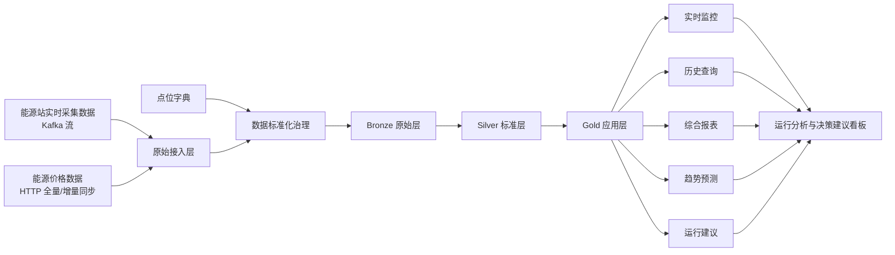
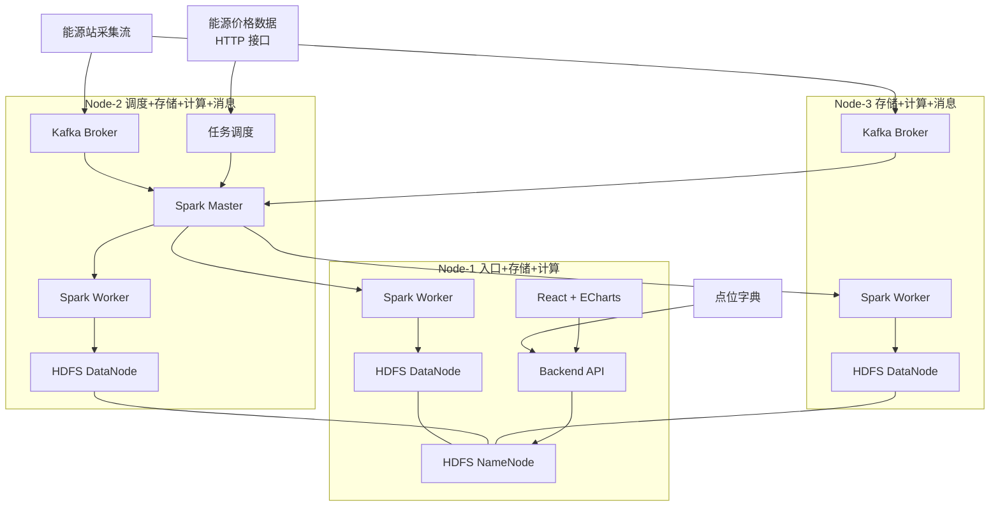
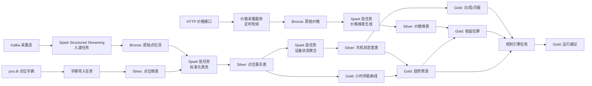

# 作业 2 第一阶段系统设计方案

> 版本说明:本版在第一版的基础上做了较大调整。主要变化包括重构部署架构以避免单点过载、明确性能对比基准、按系统类型分拆设备状态表、补充时序数据表与数据湖维护策略、以及对接入方式、缺失值阈值、时区等细节进行了修正。

## 1. 作业理解与设计范围

根据作业要求,平台至少要覆盖下面五类任务:

1. 数据采集
2. 数据治理与存储
3. 数据分析计算
4. 平台展示与业务分析
5. 分布式有效性验证

本组最后决定采用 `Kafka + Spark + Delta Lake + HDFS + React + ECharts` 这条主线架构,围绕"站点 - 系统 - 设备 - 点位"四层对象来组织平台。

考虑到课程提供的采集数据集只覆盖北站(1 号站)2018 年若干月份的数据,本方案把业务范围明确为**单站点(北站)、跨系统**的协同监测与分析,跨站点联合分析作为方案中可扩展的部分写出来,但不作为第一阶段必交内容。第一阶段先把冷机系统作为主要展示对象,第二阶段优先完成冷机系统的实时接入、标准化治理、统计报表、趋势预测和前端展示。

## 2. 系统业务架构

### 2.1 业务问题

从实际业务场景来看,这个平台主要要解决下面几个问题:

1. 采集点数量大、来源异构,实时采集数据与价格数据分散,难以统一接入。
2. 实时监控、历史查询、周期报表、预测分析会同时发生,单机方案难以兼顾吞吐与响应。
3. 能源站内部包含冷机、锅炉、发电机、三联供等多类系统,单点数据价值有限,需要跨设备、跨主题的综合分析。
4. 运维人员不仅需要"看到数据",还需要"理解问题"和"得到建议",例如是否关停某台设备、是否存在异常风险、当天收益如何。

### 2.2 业务目标

结合上面这些问题,本组希望先把下面几个目标做出来:

1. 建立统一的数据接入与治理链路,实现能源采集数据和价格数据的集中管理。
2. 构建基于 Delta Lake 的分层数据湖,支持可追溯、可清洗、可复用的数据资产管理。
3. 同时支持实时监控和历史分析,满足设备级、主题级、系统级三类查询需求。
4. 输出日报、周报、月报以及趋势预测结果,为运行分析和调度建议提供依据。
5. 通过集群部署和任务并行证明分布式方案相对单机方案的价值。

### 2.3 服务对象

平台主要面向以下三类使用者:

1. **运维人员**:关注设备状态、异常点位、实时曲线和故障预警。主要使用设备级查询页与运行分析看板。
2. **站点管理者**:关注系统负荷、供能效率、峰谷特征、收益情况和日报/月报。主要使用系统级综合页与收益分析页。
3. **能源调度或分析人员**:关注跨系统对比、趋势预测、运行策略和调度建议。主要使用主题级查询页、趋势预测页与运行分析看板。

### 2.4 业务流程



## 3. 系统功能架构

### 3.1 总体功能分层

从实现角度看,系统可以拆成六层,每一层负责的内容相对清楚。

| 层次 | 核心模块 | 主要职责 |
| --- | --- | --- |
| 数据接入层 | Kafka 流接入、价格 HTTP 同步、点位字典导入 | 接收采集流、同步价格数据、加载点位字典 |
| 数据治理层 | 清洗标准化、时间对齐、缺失值处理、口径统一 | 将异构原始数据加工为统一结构 |
| 数据存储层 | Bronze / Silver / Gold 数据湖 | 承接原始、明细、主题、报表、预测结果存储 |
| 计算分析层 | Spark Structured Streaming、周期报表、趋势预测、收益分析、**建议规则引擎** | 统一承接流处理与批处理任务,**建议结果作为可追溯的数据产物落地** |
| 应用服务层 | REST API、报表 API、预测 API、建议查询 API | 为前端页面和展示层提供服务 |
| 展示交互层 | React 页面、ECharts 图表、查询面板、结果看板 | 完成可视化展示和业务解读 |

> 说明:相比第一版,本版把"建议引擎"从应用服务层挪到了计算分析层。建议是基于 Gold 层数据通过规则匹配产出的数据产物,应该写入 `gold_operation_advice` 表,API 层只负责读取,这样建议结果可以追溯、可以重算。

### 3.2 与五项任务的映射关系

| 作业任务 | 系统模块 | 预期产出 |
| --- | --- | --- |
| 任务一:数据采集 | Kafka 接入、价格同步、点位字典导入 | 实时流、价格维表、点位字典 |
| 任务二:数据治理与存储 | Bronze/Silver/Gold 分层、清洗对齐、宽表构建 | 标准事实表、维表、应用层结果表 |
| 任务三:数据分析计算 | 报表任务、预测任务、收益计算任务、建议规则任务 | 日/周/月报表、趋势预测结果、运行建议 |
| 任务四:平台展示与业务分析 | 查询接口、可视化大屏、运行分析看板 | 多层级查询页面、运行分析与建议输出 |
| 任务五:分布式有效性验证 | 集群对比实验、任务并发实验 | 集群优于单机的性能证据 |

### 3.3 前端展示模块设计

前端部分按六类页面规划。每个页面对应的主要使用者已在括号中标出。

1. **设备级查询页**(运维人员):按站点、设备、点位查看历史曲线和最新值。
2. **主题级查询页**(调度/分析人员):按温度、流量、压力、能耗、功率等主题聚合展示。
3. **系统级综合页**(站点管理者):以冷机系统为核心展示对象,展示全部冷机设备状态和系统报表。
4. **趋势预测页**(调度/分析人员):展示不同模型或同一模型在不同对象上的预测曲线。
5. **收益分析页**(站点管理者):结合当日价格与供能预测,估算站点日收益。
6. **运行分析看板**(运维 + 管理者):汇总当日运行建议、风险等级、证据指标,作为决策支持的入口页面。

前端实现采用 `React + ECharts`。页面结构上以查询筛选区、核心指标卡片、趋势图表区和建议输出区为主,便于组件化和图表联动。

**实时更新机制**:第一阶段采用前端轮询方式,每 5 秒从 API 拉取最新值;趋势曲线按 1 分钟刷新。若第二阶段时间充足,可升级为 SSE(Server-Sent Events)推送。

### 3.4 决策建议模块设计

决策建议模块的目标不是做复杂的规则推理,而是基于 Gold 层数据通过 SQL 表达的规则产出可解释的建议。落地路径:

1. **规则配置表** `gold_advice_rule`:字段包括 `rule_id`、`rule_name`、`condition_sql`、`advice_template`、`risk_level`、`enabled`。规则以 Spark SQL 片段形式配置,便于增删改而无需改代码。
2. **建议生成任务**:每天(或每小时)运行一个 Spark 批任务,遍历启用的规则,扫描 Gold 层数据,把命中结果写入 `gold_operation_advice` 表。
3. **典型规则示例**:
   - 当预测负荷下降 30% 以上、且当前运行机组数大于按负荷推算的需要机组数时,建议关停部分机组。
   - 当冷冻水进出水温差异常、流量低于阈值、压力波动剧烈三个条件同时出现时,提示可能存在传感器异常或设备异常。
   - 当能源价格波动幅度超过 ±15%、且预测负荷较高时,结合价格波动方向给出收益提醒。

## 4. 系统部署架构

### 4.1 部署原则

本组采用三节点部署方案。**与第一版方案相比,本版重构了节点角色划分,核心思路是把"主控类组件"分散到不同节点、让所有节点都参与存储与计算**。这样可以:

1. 避免单一节点同时承担过多角色,避免成为性能瓶颈和单点故障。
2. 让三节点都成为 DataNode 和 Spark Worker,使 HDFS 副本数能达到 3,Spark 并行度真正是 3。
3. 让 Kafka 在两个节点上各部署一个 broker,支撑分区并行接入。
4. 即便任意一台 Worker 节点挂掉,Spark 集群仍能调度任务,有"容错"的故事可讲。

> NameNode 仍为单点。在生产环境通常使用 ZooKeeper + Standby NameNode 解决,本作业受三节点规模限制不展开。

### 4.2 节点角色设计

| 节点 | 角色定位 | 部署组件 |
| --- | --- | --- |
| Node-1 | 入口 + 存储 + 计算 | HDFS NameNode、HDFS DataNode、Spark Worker、Backend API、React 前端 |
| Node-2 | 调度 + 存储 + 计算 + 消息 | Spark Master、HDFS DataNode、Spark Worker、Kafka Broker、任务调度(crontab / Airflow) |
| Node-3 | 存储 + 计算 + 消息 | HDFS DataNode、Spark Worker、Kafka Broker |

### 4.3 部署图



### 4.4 部署说明

1. **HDFS** 作为底层分布式存储,承载 Delta Lake 数据文件。三个 DataNode + 默认副本数 3,保证任何一台节点宕机数据不丢。
2. **Spark** 负责主数据链路,包括 Structured Streaming 入湖、批量清洗、报表计算、预测和建议规则任务。Driver 采用 `cluster` 模式提交,避免 Master 节点压力过大。
3. **Kafka** 双 broker 部署,topic 分区数设置为 3 或 6 的倍数,支撑并行消费。
4. **Backend API** 和 **React 前端** 放在 Node-1,便于统一入口访问和演示。
5. **任务调度** 第一阶段先用 crontab 触发 Spark 批任务,若第二阶段时间充足可换 Airflow。

### 4.5 端口规划

作业明确要求配置安全组开放端口。规划如下(仅对组内 IP 开放):

| 服务 | 端口 | 节点 |
| --- | --- | --- |
| HDFS NameNode RPC | 9000 | Node-1 |
| HDFS NameNode Web UI | 9870 | Node-1 |
| HDFS DataNode | 9866 / 9864 | Node-1/2/3 |
| Spark Master | 7077 | Node-2 |
| Spark Master Web UI | 8080 | Node-2 |
| Spark Worker Web UI | 8081 | Node-1/2/3 |
| Kafka Broker | 9092 | Node-2/3 |
| Backend API | 8000 | Node-1 |
| React 前端 | 3000 / 80 | Node-1 |

### 4.6 存储路径规划

1. **HDFS 数据根目录**:`hdfs://node-1:9000/lake/`
2. **Bronze 层路径**:`hdfs://node-1:9000/lake/bronze/<table_name>/`
3. **Silver 层路径**:`hdfs://node-1:9000/lake/silver/<table_name>/`
4. **Gold 层路径**:`hdfs://node-1:9000/lake/gold/<table_name>/`
5. **Spark checkpoint 路径**:`hdfs://node-1:9000/checkpoints/<job_name>/`,用于 Structured Streaming 状态保存与故障恢复。
6. **本地工作目录**:每台节点的 `/data/spark-local/`,Spark shuffle 临时文件。

## 5. 数据架构

### 5.1 数据源设计

| 数据源 | 类型 | 更新方式 | 作用 |
| --- | --- | --- | --- |
| 能源站采集数据 | 实时流数据 | Kafka 持续推送 | 提供设备与点位的实时观测值 |
| 能源价格数据 | 批量 + 增量数据 | HTTP `/full` 全量快照(每日 8:00 后拉取) + HTTP `/` binlog 增量轮询(每 5 分钟一次) | 提供站点级电价、冷价、热价等价格信息 |
| 点位字典数据 | 元数据 | 手动导入或初始化加载(`pos.ttl` 解析) | 提供点位名称、设备归属、主题语义 |

> 价格接入修正说明:作业提供的是 HTTP 接口而非真实的 MySQL binlog CDC,因此采用"HTTP 全量 + HTTP 增量轮询"的描述更准确。

目前已经确认的实时采集接入特征如下:

1. Kafka 采用"每个点位一个 topic"的组织方式,topic 命名模式为 `sensor_<sensor_id>`。
2. 由于 topic 数量可能较多,**Spark Structured Streaming 端使用 `subscribePattern = sensor_.*` 统一订阅**,避免逐 topic 配置。
3. 实时消息体为 JSON 结构,至少包含 `sensor_id`、`label`、`timestamp`、`value`、`is_simulated`、`push_time` 六个字段。
4. 其中 `timestamp` 表示业务采样时间(UTC),`push_time` 表示消息推送到 Kafka 的时间。

### 5.2 数据湖分层设计

数据存储采用 Delta Lake 三层结构,方便把原始数据、标准化数据和最终结果分开管理。

| 层级 | 作用 | 典型表 |
| --- | --- | --- |
| Bronze | 保留原始数据,支持追溯和重放 | `bronze_sensor_raw`、`bronze_price_raw` |
| Silver | 完成标准化、清洗、时间对齐、主题建模 | `silver_point_fact`、`silver_chiller_status`、`silver_price_dim`、`silver_point_meta_dim` |
| Gold | 面向应用和展示,沉淀报表、预测和建议结果 | `gold_report_day`、`gold_supply_curve_hourly`、`gold_forecast_supply`、`gold_profit_estimate`、`gold_operation_advice`、`gold_advice_rule` |

### 5.3 关键数据表设计

#### 5.3.1 Bronze 层

| 表名 | 逻辑去重键 | 关键字段 | 说明 |
| --- | --- | --- | --- |
| `bronze_sensor_raw` | `topic + partition + offset` | `source_topic`、`partition_id`、`offset_id`、`sensor_id`、`label`、`event_time`、`value`、`is_simulated`、`push_time`、`payload_json`、`ingest_time` | 原始流式数据,保留 Kafka 原始消息及解析出的核心字段,支持回放与追溯 |
| `bronze_price_raw` | `id + updated_at` | `id`、`station_code`、`price_type`、`price`、`created_at`、`updated_at`、`source_type`、`ingest_time` | 原始价格数据,保留全量和增量同步结果 |

> Delta Lake 没有强主键约束,这里的"逻辑去重键"通过 Streaming `foreachBatch + MERGE INTO` 实现幂等写入,避免 Spark 任务重启时重复消费。

#### 5.3.2 Silver 层

| 表名 | 主键设计 | 关键字段 | 说明 |
| --- | --- | --- | --- |
| `silver_point_fact` | `station_id + point_code + event_time` | `station_id`、`point_code`、`point_name`、`system_type`、`equipment_id`、`theme`、`event_time`、`value`、`unit`、`is_simulated`、`quality_flag` | 标准化后的点位事实表,由 Kafka topic 和点位字典共同映射得到 |
| `silver_chiller_status` | `station_id + equipment_id + stat_time` | `station_id`、`equipment_id`、`supply_temp`、`return_temp`、`pressure`、`flow`、`power`、`runtime_hours`、`start_count`、`run_flag` | **冷机系统**设备状态宽表 |
| `silver_boiler_status` | `station_id + equipment_id + stat_time` | `station_id`、`equipment_id`、`flue_temp`、`steam_pressure`、`fuel_flow`、`run_flag` | **热机/锅炉系统**设备状态宽表(预留,第二阶段扩展时使用) |
| `silver_cchp_status` | `station_id + equipment_id + stat_time` | `station_id`、`equipment_id`、`gas_flow`、`power_gen`、`heat_supply`、`cooling_supply`、`run_flag` | **三联供系统**设备状态宽表(预留) |
| `silver_price_dim` | `station_code + price_type + effective_date` | `station_code`、`price_type`、`price`、`effective_date`、`updated_at` | 标准价格维表,用于收益分析和价格查询 |
| `silver_point_meta_dim` | `point_code` | `point_code`、`point_name`、`station_id`、`system_type`、`equipment_id`、`theme`、`measure_role`、`unit` | 点位字典维表 |

> 与第一版的区别:第一版只有一张 `silver_equipment_status`,字段集中在水路设备上(冷机/热机),不适用于发电机、三联供。本版按系统类型拆为多张状态表,各表字段贴合各自设备特性。第一阶段重点实现 `silver_chiller_status`,其余作为预留结构。

#### 5.3.3 Gold 层

| 表名 | 主键设计 | 关键字段 | 说明 |
| --- | --- | --- | --- |
| `gold_report_day` | `station_id + system_type + stat_date` | `peak_value`、`valley_value`、`total_supply`、`peak_duration`、`valley_duration`、`avg_value`、`utilization_rate` | 日报表(总览指标) |
| `gold_report_week` | `station_id + system_type + stat_week` | 周度统计指标(同上) | 周报表 |
| `gold_report_month` | `station_id + system_type + stat_month` | 月度统计指标(同上) | 月报表 |
| `gold_supply_curve_hourly` | `station_id + system_type + stat_date + hour` | `supply_value`、`avg_temp`、`avg_flow` | **小时级供能曲线**(新增),用于前端 ECharts 趋势图绘制 |
| `gold_forecast_supply` | `station_id + system_type + forecast_time + model_name` | `pred_value`、`lower_bound`、`upper_bound`、`feature_version` | 供能趋势预测结果(小时级粒度) |
| `gold_profit_estimate` | `station_code + stat_date` | `pred_supply`、`price_type`、`energy_price`、`estimated_profit` | 收益估算结果 |
| `gold_operation_advice` | `station_id + advice_time + advice_type` | `risk_level`、`advice_text`、`evidence_metrics`、`rule_id` | 运行建议结果 |
| `gold_advice_rule` | `rule_id` | `rule_name`、`condition_sql`、`advice_template`、`risk_level`、`enabled` | **建议规则配置表**(新增) |

> 与第一版的区别:新增 `gold_supply_curve_hourly` 时序表(解决报表表无法满足前端时序曲线展示的问题);新增 `gold_advice_rule` 规则配置表(支撑 3.4 节中描述的可配置规则引擎)。

#### 5.3.4 价格数据样例确认

根据目前拿到的价格快照样例,可以确认下面几点:

1. 共有 5 个站点编码:`ST001` 到 `ST005`。
2. 每个站点至少包含 `electricity`、`cooling`、`heating` 三类价格。
3. 原始价格记录字段包括 `id`、`station_code`、`price_type`、`price`、`created_at`、`updated_at`。
4. 在标准层可将 `DATE(updated_at)` 作为 `effective_date`,用于按日关联收益分析。

#### 5.3.5 实时采集消息样例

```json
{
  "sensor_id": "10LDSCS_T",
  "label": "2#站1#冷机冷冻水出水温度",
  "timestamp": "2018-02-01T00:04:47Z",
  "value": 8.8,
  "is_simulated": false,
  "push_time": "2026-04-21T09:26:34"
}
```

Silver 层先根据 `source_topic` 或 `sensor_id` 关联点位字典,再补齐 `station_id`、`equipment_id`、`system_type`、`theme` 等字段。

### 5.4 时间字段、时区与分区策略

**时区策略**(新增):

1. 所有存储字段统一使用 **UTC** 时区。Kafka 消息中的 `timestamp` 已是 UTC(带 `Z` 后缀),`push_time` 由发送端补齐时区信息。
2. Spark Session 配置 `spark.sql.session.timeZone = "UTC"`,保证所有计算口径一致。
3. 前端展示统一转换为 `Asia/Shanghai`,由 API 层在响应时完成转换。

**时间字段**:

1. 实时采集主时间字段采用 `event_time`,表示业务发生时间(UTC)。
2. 入湖附加字段采用 `ingest_time`,用于区分迟到数据与重放数据。

**分区策略**:

1. Bronze 和 Silver 事实表按 `dt=yyyy-MM-dd`(基于 `event_time`)单级分区。**不叠加 `station_id` 二级分区**,因为当前只有一个站点,二级分区反而增加元数据负担。多站点扩展时再补。
2. Gold 报表表按统计周期字段分区(`stat_date`、`stat_month`)。
3. **价格表按 `price_year_month`(`YYYYMM`)分区**,而非按天分区。价格每天只更新少量记录,按月聚合避免小文件问题。

### 5.5 缺失值处理策略

缺失值不适合统一套一个规则,因此按指标类型分别处理,并明确"短时/长时"阈值:

1. **状态型字段**(运行开关、启停标志):优先采用前值保持,若前值距当前超过 1 小时则不伪造状态,标记 `quality_flag = 'status_stale'`。
2. **连续型字段**(温度、压力、流量):
   - 连续缺失 ≤ 5 个采样周期(假设采样间隔 1 分钟即 5 分钟)为短时缺失,当前实现采用上一条有效值填充,后续可扩展为时间窗口线性插值。
   - 连续缺失 > 5 个采样周期为长时缺失,保留 NULL 并标记 `quality_flag = 'long_missing'`,报表计算时按规则剔除。
3. **累计型字段**(累计能量、运行时长):禁止直接线性补值,优先保留缺失并在报表计算时剔除该异常区间,同时标记 `quality_flag = 'cumulative_gap'`。
4. **价格字段**:Silver 价格维表先做去重和生效日期标准化;收益计算若当天价格缺失,回退到最近一个有效价格,并在计算口径中说明该价格为回退值。
5. **流式微批说明**:全量 Silver 已实现上述治理;流式 Silver 当前先保证增量接入、去重和空值质量标记,跨批次前值填充属于后续增强项。

### 5.6 数据湖维护策略

Delta Lake 在流式入湖场景下天然会产生大量小文件,如果不做治理,几天后查询性能会显著下降。本组的维护策略如下:

1. **OPTIMIZE**:每日凌晨 2:00 低峰期对 Bronze、Silver 表执行 `OPTIMIZE ... ZORDER BY (station_id, event_time)`,合并小文件并按查询热点字段排序。
2. **VACUUM**:每周对各表执行一次 `VACUUM`,清理超过 7 天的历史版本文件(保留 Delta 默认窗口)。
3. **Compaction 触发条件**:Streaming 任务按 `trigger=processingTime='1 minute'` 微批入湖,微批粒度避免过细。
4. **Checkpoint 管理**:Structured Streaming checkpoint 单独放在 `/checkpoints/<job_name>/`,任务停止时不删除,以支持续传。

### 5.7 数据流设计



> 与第一版的区别:本版在 Kafka 与 Bronze、HTTP 接口与 Bronze、点位字典与 Silver 之间分别加入了执行者节点(Spark Structured Streaming、价格采集服务、字典导入任务),明确了"谁在写"这一关键链路。

## 6. 五项任务的具体设计

### 6.1 任务一:数据采集

能源站采集数据通过 Kafka 接收实时流并由 Spark Structured Streaming 写入 Bronze 层。Kafka 采用"每点位一个 topic"组织方式,消费端使用 `subscribePattern = sensor_.*` 统一订阅。能源价格数据通过 HTTP 接口接入:系统启动时通过 `/full` 拉取全量快照,之后通过 `/`(binlog)每 5 分钟轮询增量。点位字典在系统初始化时从 `pos.ttl` 解析后落地为 `silver_point_meta_dim` 维表。

### 6.2 任务二:数据治理与存储

Silver 层至少完成四件事:点位编码映射、单位与字段标准化、时间对齐、缺失值处理。对实时流,系统先根据 `sensor_id` 关联点位字典,补齐 `station_id`、`system_type`、`equipment_id`、`theme` 等业务字段;再按 5.5 节策略处理缺失值;最后形成按点位存储的事实表(`silver_point_fact`)和按设备聚合的状态宽表(`silver_chiller_status`)。Gold 层在 Silver 基础上沉淀报表、时序曲线、预测和建议结果。

### 6.3 任务三:数据分析计算

本组计划至少完成 1 类统计报表和 1 类趋势预测。

**统计报表**:

1. 优先完成冷机系统日报表(`gold_report_day`),并扩展到周报和月报。
2. 核心指标:峰值、谷值、总供能量、峰值期时长、谷值期时长、平均值、设备利用率。
3. **峰谷判定规则**:按当日数据的分位数判定。`value ≥ P95` 为峰值期、`value ≤ P5` 为谷值期。`peak_duration` 为峰值期累计时长(分钟)。这种方式不依赖固定时段配置,适应不同季节的负荷模式。
4. 同时产出小时级供能曲线 `gold_supply_curve_hourly` 供前端绘图。

**趋势预测**:

1. **预测对象**:冷机系统总供冷量。
2. **预测粒度**:小时级。
3. **预测窗口**:用过去 30 天历史数据预测未来 24 小时。
4. **特征设计**:
   - 时间特征:小时、星期、月份、是否工作日。
   - 历史负荷:前 1/24/168 小时负荷值(滞后特征)、近 24 小时均值/最大值。
   - 季节特征:基于 `month` + `hour` 编码。
5. **模型选择**:第一阶段以 ARIMA 或基于滑动窗口的回归模型(如 XGBoost)为主,易实现可解释;若第二阶段时间充足,补充 LSTM 作为对比。
6. **评估指标**:MAPE、RMSE、MAE。训练集与测试集按时间切分(后 7 天作测试集)。
7. **调度频率**:每天凌晨 3:00 滚动重训练并预测未来 24 小时,结果写入 `gold_forecast_supply`。

### 6.4 任务四:平台展示与业务分析

前端按"设备级 - 主题级 - 系统级 - 预测级 - 收益级 - 运行分析看板"六个页面展开。用户既可以看单个点位的历史变化,也可以从冷机系统整体观察运行情况。系统在展示预测曲线的同时,会结合当前设备状态、负荷水平和价格信息从 `gold_operation_advice` 表读取并展示建议。前端实现采用 React + ECharts。实时数据通过前端每 5 秒轮询 API 拉取最新值。

### 6.5 任务五:分布式有效性验证

本组主选"性能对比验证",同时在文档中保留扩展性和容错性的简单演示作为补充。

**性能对比基准设定**:

| 设定项 | 单机基准 | 集群基准 |
| --- | --- | --- |
| Spark 提交方式 | `spark-submit --master local[*]` | `spark-submit --master spark://node-2:7077 --deploy-mode cluster` |
| 执行节点 | Node-1 单机 | 三节点 Spark 集群 |
| 数据源 | 同样从 HDFS 读取(避免本地盘对比不公平) | 从 HDFS 读取 |
| 数据规模 | 同样的输入(例如 2018 年 1 月一个月全量) | 同样输入 |
| 重复次数 | 每场景跑 3 次,取中位数 | 每场景跑 3 次,取中位数 |

**具体验证场景**:

| 实验场景 | 对比对象 | 输入规模 | 指标 |
| --- | --- | --- | --- |
| 报表生成 | 单机 Spark / 三节点 Spark 集群 | 冷机系统日、周、月数据 | 总耗时、吞吐量 |
| 历史查询 | 单机查询 / 集群查询 | 多设备、多时间范围查询 | 平均响应时间、P95 响应时间 |
| 多任务并发 | 单任务 / 并发任务 | 实时接入 + 报表 + 预测 + 前端查询 | 稳定性、任务完成时间、资源利用率 |

**扩展性与容错性补充演示**(若答辩追问可展示):

1. 扩展性:通过 Spark 动态调整 `--num-executors` 或临时关闭某个 Worker 节点,观察任务完成时间变化。
2. 容错性:`kill -9` 一个 Worker 进程,观察 Spark 自动重新调度和 Streaming 任务从 checkpoint 恢复的能力。

## 7. 数据安全与合规

作业明确提示"数据来源为企业私有,务必不要把数据上传至公网"。本组采取的措施:

1. **网络层**:华为云安全组只对组内成员 IP 开放端口,Web UI 端口(NameNode 9870、Spark Master 8080)不对外开放。
2. **应用层**:Backend API 增加简单的 Token 鉴权,前端访问需登录。
3. **代码层**:Git 仓库不提交任何原始数据样本、不提交密钥与服务器 IP;`.gitignore` 排除 `data/`、`*.csv`、`*.json`。
4. **共享层**:Vibe coding 上下文文档中只描述数据结构与字段语义,不包含真实数据值。

## 8. 第二阶段安排

结合目前已经确认的数据来源和部署方式,第二阶段准备按下面的顺序推进。先把数据链路打通,再逐步补分析和展示,整体会更稳一些。

1. 完成集群环境确认与基础联通,包括 HDFS、Spark、Kafka 和 Web 访问链路。
2. 打通"Kafka 入湖到 Bronze"的最小闭环。
3. 完成点位字典解析与 Silver 层标准化建模(冷机系统优先)。
4. 实现冷机系统日报表与趋势预测,产出 Gold 层数据。
5. 完成前端展示页(设备级 → 系统级 → 预测页 → 运行分析看板)。
6. 完成性能对比实验,补充扩展性/容错性演示。
7. 整理 Vibe coding 上下文文档与答辩材料。

**Vibe coding 上下文**:在仓库 `/docs/vibe-context/` 下维护项目说明、表结构、API 契约、规则配置等文档,作为 LLM 编码辅助时的统一上下文,也作为第二阶段提交内容的一部分。

## 9. 预期完成情况

从作业要求来看,第二阶段至少要把下面几项内容做出来,才能说明第一阶段这套方案是能够真正落地的:

1. **接入有效性**:实时采集数据能够持续写入 Bronze 层,价格数据能够按日更新。
2. **治理完整性**:至少形成 Bronze、Silver、Gold 三层数据表,并能说明字段口径与流转关系。
3. **分析有效性**:至少完成 1 类统计报表和 1 类趋势预测,并能展示结果页面。
4. **展示完整性**:至少完成设备级、主题级、系统级、预测级、运行分析看板五类界面中的核心展示。
5. **分布式价值**:在至少一个实验场景中证明集群模式优于单机模式。

## 10. 方案说明

考虑到第二阶段的时间和任务范围,本组没有把重点放在继续扩充技术栈上,而是先围绕冷机系统整理出一条完整、可实现的处理链路:

1. 以 Spark + Delta Lake 为核心链路,工程复杂度可控,便于第二阶段集中实现。
2. 采用 Bronze / Silver / Gold 分层,便于同时支撑追溯、分析和展示。
3. 以冷机系统为主线,范围相对集中,更适合在有限时间内做出较完整的结果。
4. 选择性能对比作为验证方式,比较直观,也方便和前面的数据处理链路结合起来展示。
5. 部署架构上把主控类组件分散到不同节点,让三节点都参与存储与计算,为分布式价值的体现打下基础。

## 11. 小结

这一版方案在第一版的基础上,重点修正了部署架构(避免 Node-1 单点过载)、数据表设计(按系统类型分拆设备状态表、新增时序曲线表与规则配置表)、性能对比基准定义(明确单机/集群提交方式与数据源)、以及时区、缺失值阈值、小文件治理等细节。第二阶段会先围绕冷机系统把采集、治理、报表、预测和展示这条主链路做通,再补性能对比部分,尽量把系统做得既能运行,也能说明分布式处理在这个场景里的作用。
